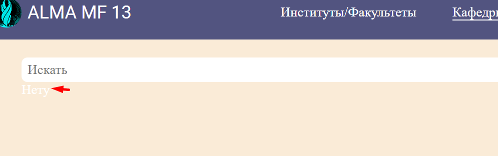

1. Есть некоторые ошибки/опечатки в readme, если будет время советую пробежаться, всё же это будет первое, что откроют в
   твоем проекте (+ на гитхабе отображается)
2. Зачем это здесь? К проекту оно никак не относится 
3. Белым текстом на белом фоне не стоит 
4. Не нужно держать пустые классы в scss файла + не нужно создавать пустые scss файлы для компонентов
5. На фронте принято имена переменных/функций/экземпляры класса писать в camelCase а не в kebab-case 
